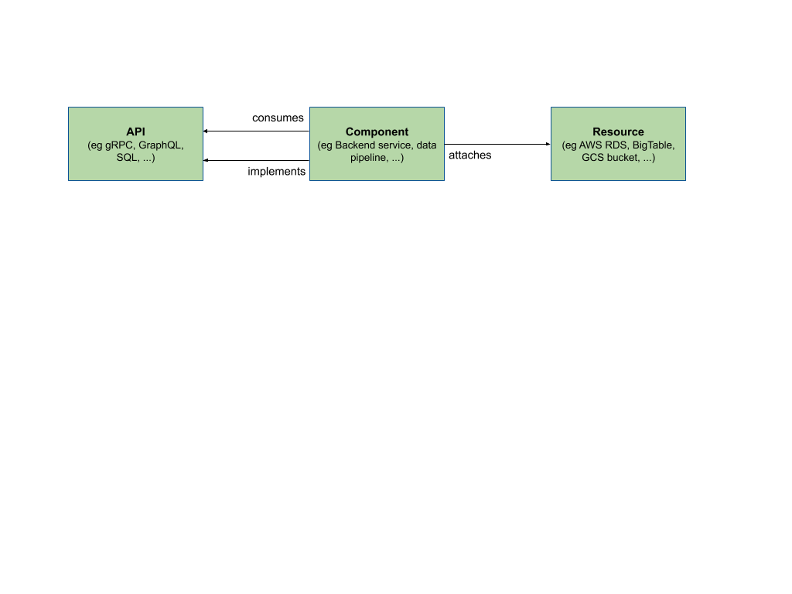

# ADR005: Catalog Core Entities

| Created    | Status |
| ---------- | ------ |
| 2020-05-29 | Open   |

## Context

We want to standardize on a few core entities that we are tracking in the
Backstage catalog. This allows us to build specific plugins around them.

## Decision

Backstage should eventually support the following core entities:

- **Components** are individual pieces of software
- **APIs** are the boundaries between different components
- **Resources** are physical or virtual infrastructure needed to operate a
  component



For now, we'll start by only implementing support for the Component entity in
the Backstage catalog. This can later be extended to APIs, Resources and other
potentially useful entities.

### Component

A component is a piece of software, for example a mobile application feature,
web site, backend service or data pipeline (list not exhaustive). A component
can be tracked in source control, or use some existing open source or commercial
software. It can implement APIs for other components to consume. In turn it
might depend on APIs implemented by other components, or resources that are
attached to it at runtime.

Component entities are typically defined in YAML descriptor files next to the
code of the component, and could look like this (actual schema will evolve):

```yaml
apiVersion: backstage.io/v1beta1
kind: Component
metadata:
  name: my-component-name
spec:
  type: service
```

### API

APIs form an abstraction that allows large software ecosystems to scale. Thus,
APIs are a first class citizen in the Backstage model and the primary way to
discover existing functionality in the ecosystem.

APIs are implemented by components and make their boundaries explicit. They
might be defined using an RPC IDL (e.g. in Protobuf, GraphQL or similar), a data
schema (e.g. in Avro, TFRecord or similar), or as code interfaces (e.g.
framework APIs in Swift, Kotlin, Java, C++, Typescript etc). In any case, APIs
exposed by components need to be in a known machine-readable format so we can
build further tooling and analysis on top.

APIs are typically indexed from existing definitions in source control and thus
wouldn't need their own descriptor files, but would be stored in the catalog
somewhat like this (actual schema will evolve):

```yaml
apiVersion: backstage.io/v1beta1
kind: API
metadata:
  name: my-component-api
spec:
  type: grpc
  definition: >
    service HelloService {
      rpc SayHello (HelloRequest) returns (HelloResponse);
    }

    message HelloRequest {
      string greeting = 1;
    }

    message HelloResponse {
      string reply = 1;
    }
```

### Resource

Resources are the infrastructure your software needs to operate at runtime like
Bigtable databases, Pub/Sub topics, S3 buckets or CDNs. Modelling them together
with components and APIs will allow us to visualize and create tooling around
them in Backstage.

Resources are typically indexed from declarative definitions (e.g. Terraform,
GCP Config Connector, AWS Cloud Formation) and/or inventories from cloud
providers (e.g. GCP Asset Inventory) and thus wouldn't need their own descriptor
files, but would be stored in the catalog somewhat like this (actual schema will
evolve):

```yaml
apiVersion: backstage.io/v1beta1
kind: Resource
metadata:
  name: my-component-db
spec:
  type: gcp-spanner
  url: spanner.googleapis.com/projects/prj/instances/my-component-db/databases/my-db
```

## Consequences

We will continue fleshing out support for the Component entity in the Backstage
catalog.
