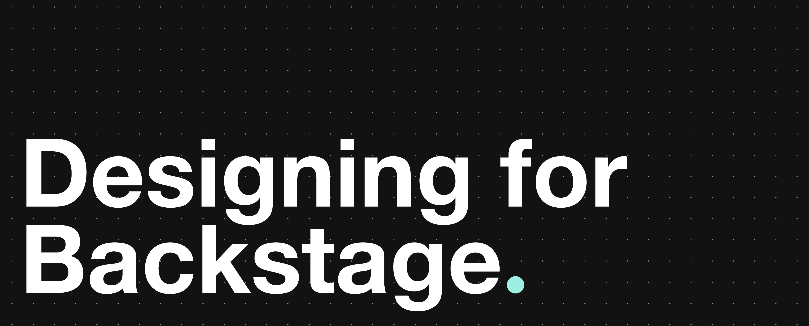
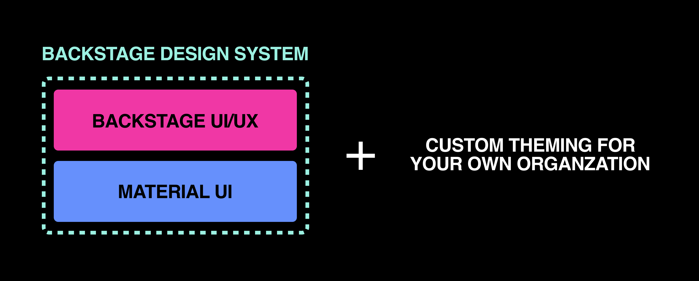

Much like Backstage Open Source, this is a *living* document! We'll keep this updated as we evolve our practices!

## 📚 Our Philosophy

### Iterative
Backstage Open Source is a newly launched endeavor, and we’re excited to scale up our design practices! With that said, we’ll be working closely with you, the community, and iterating and experimenting as we go to see what works best. As a continual work in progress, we aspire to release early and often. Not only that, we are committed to working with developers to create a seamless and easy handoff. If you’re curious to see how we grow and would like to play a role in that growth, check out the issues in this GitHub repo! 

### Collaborative
The Backstage Design Team is small but mighty, and we truly cherish the amazing opportunity we have to work with the Backstage Open Source community! Have an idea? A component request? Feel free to communicate with us via [Discord](https://discord.gg/PefUsZ) (*#design* channel). Collaboration trumps individual speed, and we want to work with you to make Backstage work for all of our users. 

### Transparent
There are a lot of exciting things coming up and we want to keep you in the loop! Keep an eye on our Milestones in GitHub to see where we’re headed. We’ll also be posting updates in the *#design* channel on [Discord](https://discord.gg/PefUsZ). Not only that, we want to keep you informed on the decisions we’ve made and why we’ve made them. 

## 🛠 Our Practice
The chart below details how we work. ***Stay tuned***: We are currently in the process of securing a Figma workspace for Backstage Open Source, and we plan on referencing Figma documents to share specs and prototypes with the community.

### Creating a New Design Component
|  Step 1 |  Step 2 | Step 3  |  Step 4 |  Step 5 | Step 6  |
|:---|:---|:---|:---|:---|:---|
|  Platform design team submits an issue to **spotify/Backstage GitHub** with a potential component. |  Backstage community offers feedback or approval on **spotify/Backstage GitHub**. |  Platform design team adjusts accordingly (as they see fit) and update the Figma DLS document. |  Designed component is added to **spotify/Backstage GitHub** as an issue. |  External or internal Backstage open source contributors build the component. |  External or internal contributors add the component to the **Backstage Storybook**. 🎉 |

### Building for Backstage
|  Step 1 |  Step 2 |  Step 3 | Step 4  | 
|:---|:---|:---|:---|
|  External or internal contributors use Backstage and come up with an idea of an entity to build for Backstage. |External or internal contributors refer to the Backstage Open Source design system documentation in the Figma DLS document.   | External or internal contributors leverage the components and tokens from the Backstage Storybook.  | External or internal contributors build their Backstage entity. | 

| Step 5  | Step 6  |  Step 7 | Step 8  |
|:---|:---|:---|:---|
| External or internal contributors make a pull request for their entity on spotify/Backstage GitHub for review.  |  Platform designers and devs review the entity and submit feedback or approval on spotify/Backstage GitHub. | External or internal contributors make the changes, pull request is approved and the entity is merged. It’s live on Backstage! 🎉  | If the entity happens to be or include a UX component, it’s added to Backstage Storybook as well.  |

The following diagram shows the relationship between the Backstage Design System and our foundation, which comprises of [Material UI](https://material-ui.com/) that is shaped by user experience and user interface decisions made by our Backstage Design Team. Also note, we encourage you to take the core experience we’ve crafted and add custom theming to better represent your organization! 

## ✅ Our Priorities
### Backstage Design System
This is the set of building blocks for Backstage contributors to leverage as they create rad plugins for Backstage! Why reinvent the wheel when you can use components that have already been vetted by our team and the Backstage community? In the spirit of crafting a cohesive and consistent user experience across all of Backstage, we strongly urge all plugin developers to utilize our Storybook as a reference. Our design system is new and evolving, and we’ll be building it up with your help! 
### Core Backstage User Experience
This is the universal user experience that is shared amongst all Backstage users. From more concrete aspects like the plugins marketplace to more abstract ones like end-to-end workflows on Backstage, we’ll be working with the community to create a core user experience that best serves you and your organization. 

## ⭐️ How to Contribute
### Pick up an issue! 
In the beginning, most of our issues will be centered around creating universal components for our Backstage Design System and adding them to our Storybook so plugin developers can reference them. We’ll also be creating issues that are focused on building up our core Backstage user experience. We’ll be labeling our issues in GitHub with ‘design’ and/or ‘storybook’ - so feel free to browse and tackle the tasks that interest you. If you have any questions regarding an issue, you can ask them in the comments section of the issue or on [Discord](https://discord.gg/PefUsZ). We absolutely adore our external contributors and will send you virtual semlas  for your contributions!

### Request a component.
Create an issue (label it design and assign it to katz95) or send us a message on [Discord](https://discord.gg/PefUsZ) (*#design* channel) with details of what the component is and its relevant use cases. Your request will be reviewed by our design team and you should hear back from us within 1-2 business days. We’ll get back to you and let you know whether your requested component will get picked up by our team as something to be added to our design system.

## ✏️ Resources
**[Storybook](http://storybook.backstage.io/)** - where you can view our components. If you’d like to help build up our design system, you can also add components we’ve designed to the Storybook as well.

**[Discord](https://discord.gg/PefUsZ)** - all design questions should be directed to the *#design* channel.

**Documentation**
- Patterns (stay tuned)
- Figma files/libraries (stay tuned)

## 🔮 Future
### Contributions from designers
Are you a designer at an organisation that’s implementing Backstage? A designer who’s fascinated by the developer productivity problem space? A designer who’s curious about open source design? We’d love for you to contribute. Behind the scenes, we’re setting up a few foundational elements to make sure that contributing to Backstage as a designer is easy. From styling guidelines to UX principles to Figma documents, we’ll make sure you’re equipped to chip in on this project. We’re excited to work with you! In the meantime, we’d love to hear from you on [Discord](https://discord.gg/PefUsZ).

[Back to Docs](../README.md)
