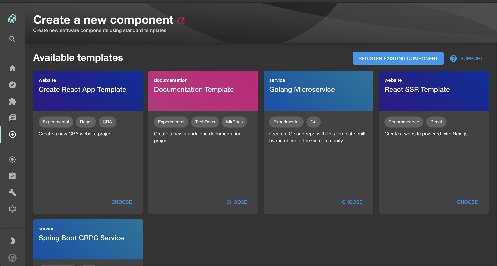

This section will guide you through:

- [Create a basic documentation setup](#create-a-basic-documentation-setup)
  - [Use the documentation template](#use-the-documentation-template)
  - [Manually add documentation setup to already existing repository](#manually-add-documentation-setup-to-already-existing-repository)
- [Writing and previewing your documentation](#writing-and-previewing-your-documentation)

## Prerequisities

- A working Backstage instance with TechDocs installed (see
  [TechDocs getting started](getting-started.md))

## Create a basic documentation setup

### Use the documentation template

Your working Backstage instance should by default have a documentation template
added. If not, follow these
[instructions](../software-templates/installation.md#adding-templates) to add
the documentation template.



Create an entity from the documentation template and you will get the needed
setup for free.

### Manually add documentation setup to already existing repository

Prerequisities:

- `catalog-info.yml` file registered to Backstage.

Create a `mkdocs.yml` file in the root of the repository with the following
content:

```yaml
site_name: 'example-docs'

nav:
  - Home: index.md

plugins:
  - techdocs-core
```

Update your `catalog-info.yaml` file in the root of the repository with the
following content:

```yaml
metadata:
  annotations:
    backstage.io/techdocs-ref: dir:./
```

Create a `/docs` folder in the root of the project with at least a `index.md`
file. _(If you add more markdown files, make sure to update the nav in the
mkdocs.yml file to get a proper navigation for your documentation.)_

The `docs/index.md` can for example have the following content:

```md
# example docs

This is a basic example of documentation.
```

Commit your changes, open a pull request and merge. You will now get your
updated documentation next time you run Backstage!

## Writing and previewing your documentation

Using the `techdocs-cli` you can preview your docs inside a local Backstage
instance and get automatic recompilation on changes. This is useful for when you
want to write your documentation.

To do this you can run:

```bash
cd ~/<repository-path>/
npx techdocs-cli serve
```
