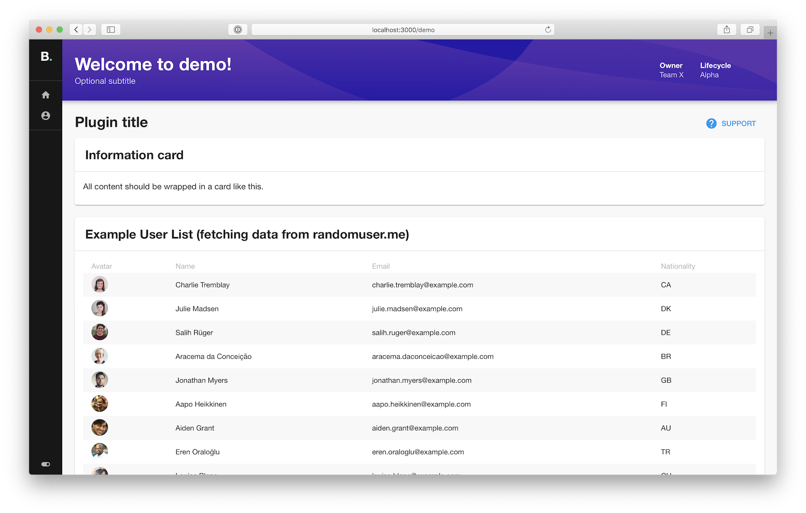

# Create a plugin

To create a new plugin, make sure you've run `yarn` and installed dependencies, then run the following on your command line (invoking the `backstage-cli`).

```bash
yarn create-plugin
```


This will create a new Backstage Plugin based on the ID that was provided. It will be built and
added to the Backstage App automatically.

_If `yarn start` is already running you should be able to see the default page for your new
plugin directly by navigating to `http://localhost:3000/my-plugin`._



[Next Step - Structure of a plugin](structure-of-a-plugin.md)

[Back to Getting Started](README.md)
