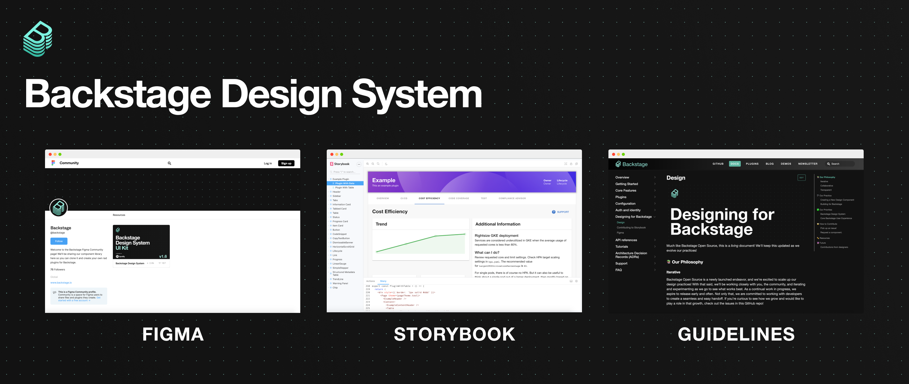
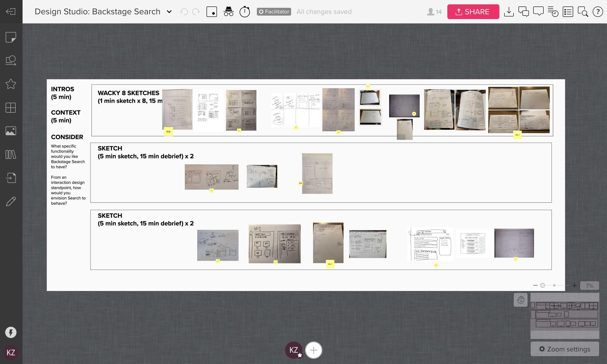
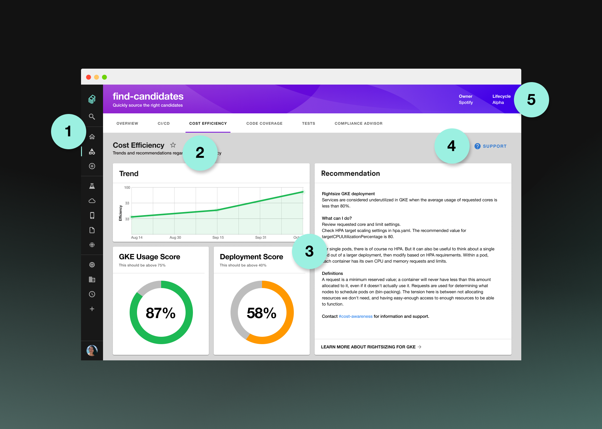
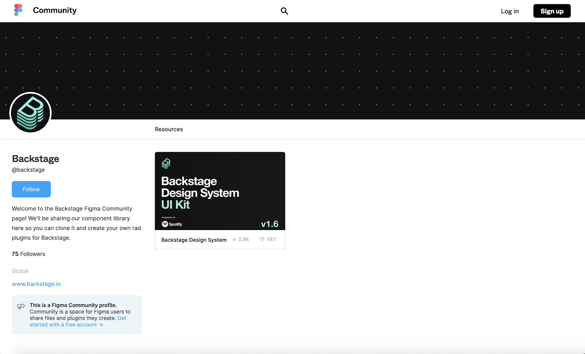
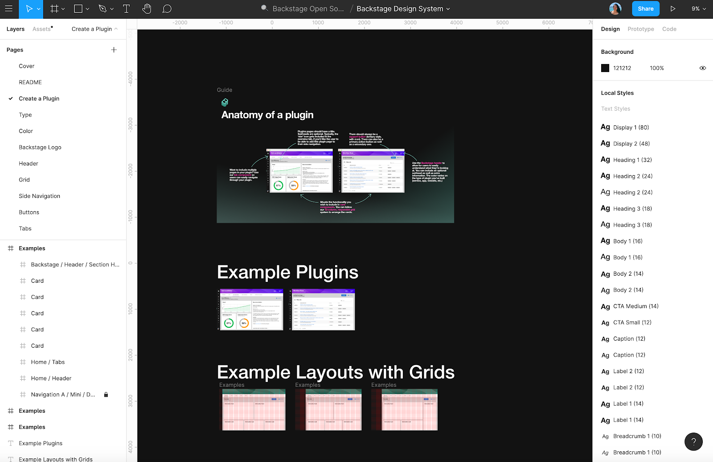
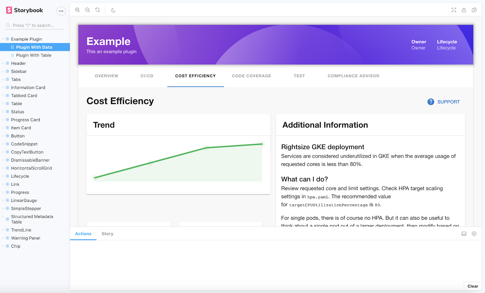
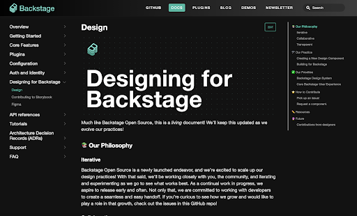
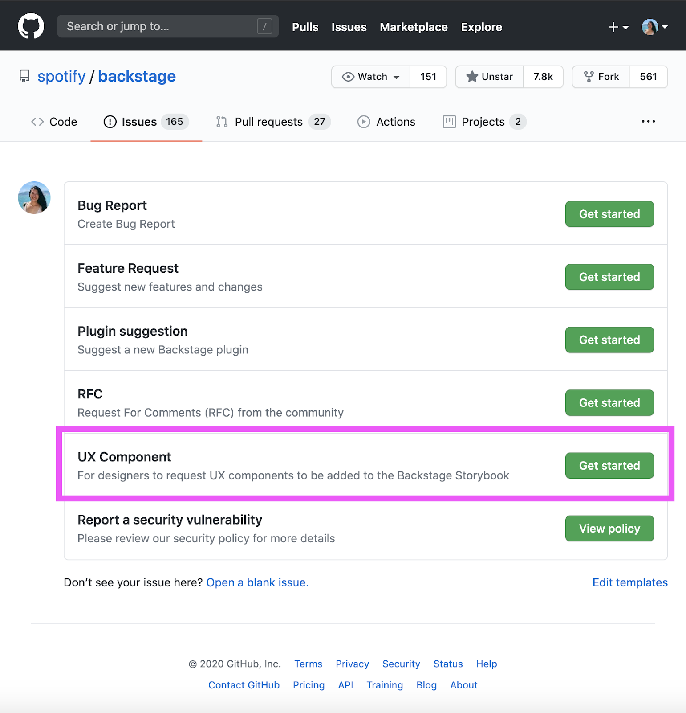
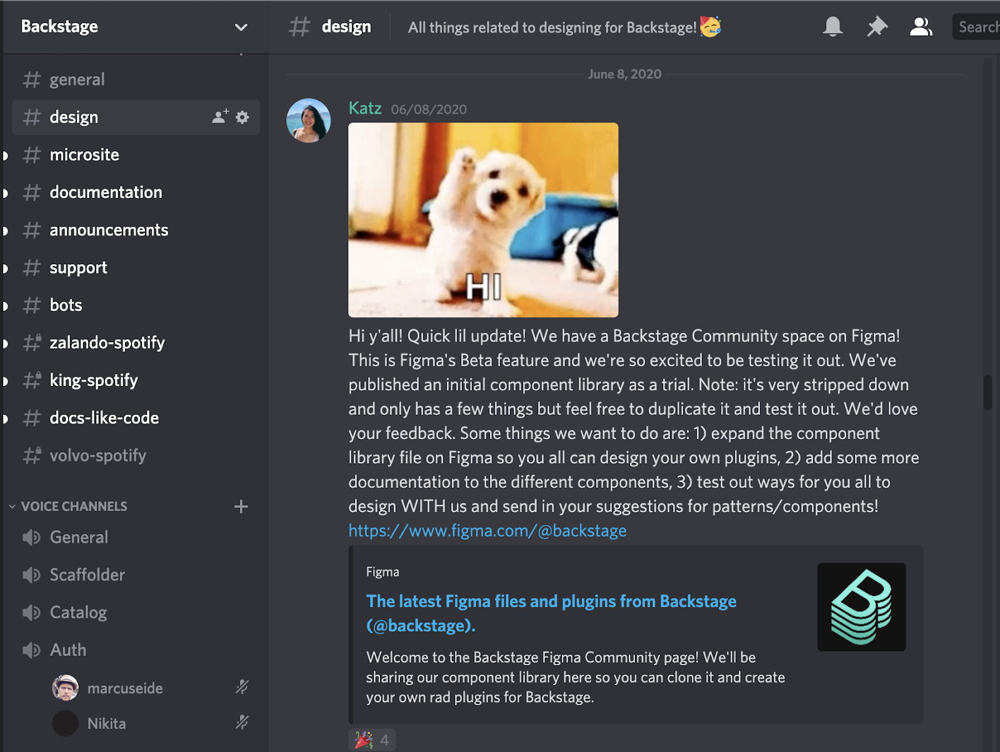
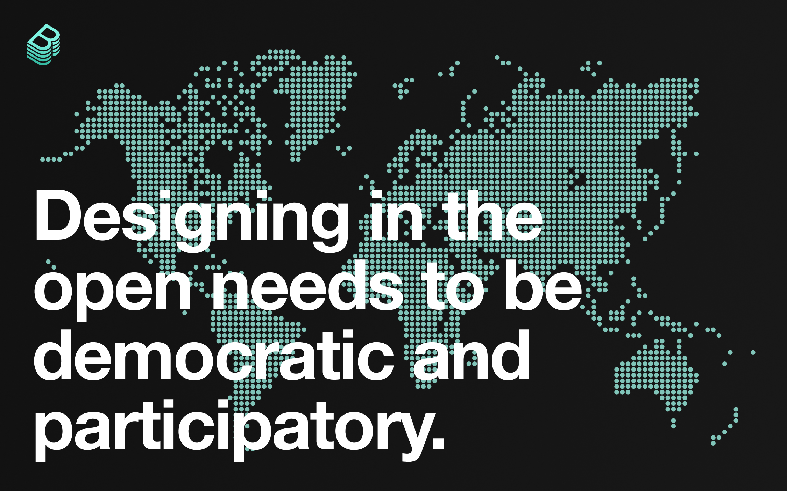

We are excited to launch the Backstage Design System, which includes a [Figma UI kit](https://www.figma.com/community/file/850673348101741100), a rich set of [reusable code components](http://backstage.io/storybook) on Storybook, and [Guidelines](https://backstage.io/docs/dls/design) for designers and developers as they build plugins for Backstage.

<!--truncate-->

## Not just the way it looks

We see great design as one of the secret weapons of Backstage. Design should never be an afterthought — we believe an elegant, cohesive UX is vital to what makes Backstage such a productive, end-to-end development environment.

Backstage keeps engineers from getting lost inside the complexity of your infrastructure by bringing order to your software ecosystem (through the [service catalog](https://backstage.io/blog/2020/06/22/backstage-service-catalog-alpha)) and providing an abstraction layer on top of it. How that abstraction layer works is essential to how Backstage works. So we’ve spent time figuring out how to make great design in Backstage easier to achieve for both designers and non-designers alike.

Since making Backstage open source, we’ve been able to host design studios and user interviews with teams outside Spotify to get feedback and collaborate on a design system, together. (And we’re always keen on collaborating with more organizations.)

_Screenshot of our design studio for Backstage Search, which included stakeholders inside and outside of Spotify._

As Backstage has gained traction, we’ve seen the importance of creating a scalable and coherent design system. It’s through the shared guidelines of our design system that we are able to maintain a unified ecosystem of plugins for our users, globally. Let’s get started by taking a closer look at the different design components of a plugin.

## Anatomy of a plugin

Plugins are what provide the feature functionality in Backstage, allowing you to customize it to fit your infrastructure. They are integrated into Backstage's frontend, so that no matter what tool or service is being accessed, users are guaranteed a seamless experience.

As you begin to [build your own plugins](https://backstage.io/docs/plugins/), we encourage you to explore the [open source plugins](https://backstage.io/plugins) we have available in Backstage, as reference. The anatomy of a plugin is simple. In the example below, we’ve highlighted a few of the standard components you should consider when designing your plugin.

1. **Tabs.** Want to include multiple pages in your plugin? Use our tab component so users can easily navigate through your plugin.
2. **Title.** Plugin pages should always have a title. Subheads are optional. Typically, the ‘star’ icon is included in the overview tab, which allows the user to favorite the plugin, adding it to the side navigation.
3. **Cards.** Use the card components to display different kinds of content and functionality. You can follow our 12-column, responsive grid system to arrange the cards.
4. **Support.** There should always be a support button (tertiary style, with icon). There can also be a primary action button as well as a secondary one.
5. **Header.** Use the Backstage header to allow for users to easily understand what they’re looking at. You can include an optional subhead as well as other information. The color varies depending on the type of plugin you’ve built (stand-alone tool, service, app, website, etc.).

Now that we’ve familiarized ourselves with the basic parts of a plugin, let’s take a look at some of the tools and resources that make designing plugins even easier.

## Tools and resources

The quickest way to start is by duplicating our [Figma UI kit](https://www.figma.com/community/file/850673348101741100), then clicking on the Create a Plugin page on the left-hand side to grab some templates. Feel free to experiment and play around! Figma is a fantastic, multiplayer tool that allows for designers and developers to co-create components and share specs with ease. We’re excited to see what you design and develop.

As you’re designing and building your plugins, make sure to take advantage of these helpful resources.

**[Figma Community](https://www.figma.com/@backstage)**

We are thrilled to be using Figma Community to share our design assets. You can duplicate our UI kit and design your own plugin for Backstage. Figma Community is currently in beta, so this is a neat opportunity to be testing out a new way of working. At the moment, it doesn’t support auto-updating of duplicated files, so we’ll be announcing new versions of our UI kit on Discord in the #design channel.

**[Storybook](https://backstage.io/storybook/)**

This is where you can view our reusable components. If you’d like to help build up our design system, you can also help us add components that we’ve designed to Storybook as well. We post newly designed components and patterns to GitHub as issues, where contributors can pick them up and add them to our Storybook so they’re available for the rest of the Backstage community.

**[Guidelines](https://backstage.io/docs/dls/design)**

To keep up with our latest design guidelines, go to [Designing for Backstage](https://backstage.io/docs/dls/design). You’ll find more how-to’s and you can also learn more about our design philosophy and practices there. Down the line, we plan on including more in-depth component rules in this section (i.e., dos/don’ts, use cases, etc.).

**[GitHub](https://github.com/spotify/backstage)**

Join in on the action by submitting issues and opening pull requests for all things related to components and patterns in Backstage.

**[Discord](https://discord.com/invite/MUpMjP2)**
All design questions should be directed to the [#design](https://discord.com/channels/687207715902193673/696709358544879716) channel.

## What's next for Backstage design

There are a lot of exciting things that we’re envisioning for Backstage and open source design at Spotify. These include:

- Expanding our Backstage Design System by building on the UI kit and component library in Figma and Storybook

* Collaborating with more of our amazing contributors to ensure our Backstage Design System works for everyone

* Featuring rad plugins that folks have created, using our design system, in our Figma Community space

* Building up our Guidelines by continuing to creating robust design documentation

* Ensuring that we maintain accessible practices throughout our experience

## Get involved

Designing in the open needs to be democratic and participatory, which is why we invite you to join in on the fun! There are a couple things you can do to get involved, such as:

- **Build with us!** Are there components/plugins that you’d like to see in Backstage? Feel free to create an example/prototype of what you’re envisioning and create a UX component issue in our GitHub repo.

- **Chat with us!** If you have questions, ideas, or puppy GIFs, feel free to reach out to us on Discord in the #design channel.

- **Share with us!** One of our priorities is making Backstage more accessible, and we need your help. If you’ve got A11Y insights and ideas on how we can improve our product, please let us know!

- **Work with us!** We are hiring for product designers to work on Backstage. We strongly stand for breaking traditional pipelines and elevating our caliber by hiring the best folks who are underrepresented minorities in tech today. Keen on joining? Know someone who has a knack for open source design and design systems? Send a direct message to @katz on Discord!
