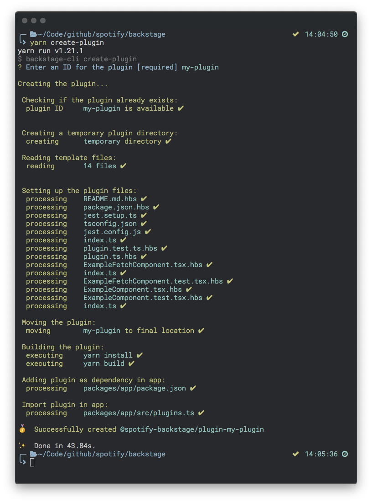

# Plugin Development in Backstage
Backstage plugins provide features to a Backstage App. 

Each plugin is treated as a self-contained web app and can include almost any type of content. 
Plugins all use a common set of platform APIs and reusable UI components. 
Plugins can fetch data from external sources using the regular browser APIs or by depending on 
external modules to do the work.

## Creating a new plugin
On your command line, invoke the `backstage-cli` to create a new plugin:
```bash
yarn create-plugin
```



This will create a new Backstage Plugin based on the ID that was provided. It will be built and 
added to the Backstage App automatically.

*If `yarn start` is already running you should be able to see the default page for your new 
plugin directly by navigating to `http://localhost:3000/my-plugin`.*


## Developing guidelines

- Consider writing plugins in `TypeScript`.
- Plan the directory structure of your plugin so that it becomes easy to manage.

## Plugin concepts / API

### Routing
Each plugin is responsible for registering its components to corresponding routes in the app.

The app will call the `createPlugin` method on each plugin, passing in a `router` object with a set 
of methods on it.

```typescript
import { createPlugin } from '@spotify-backstage/core';
import ExampleComponent from './components/ExampleComponent';

export default createPlugin({
  id: 'my-plugin',
  register({ router }) {
    router.registerRoute('/my-plugin', ExampleComponent);
  },
});
```

#### `router` API
```typescript
type RouterHooks = {
  registerRoute(
    path: RoutePath,
    Component: ComponentType<any>,
    options?: RouteOptions,
  ): void;

  registerRedirect(
    path: RoutePath,
    target: RoutePath,
    options?: RouteOptions,
  ): void;
};
```
